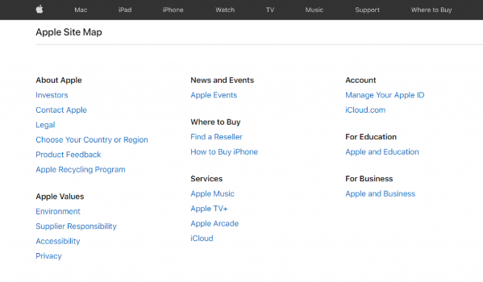
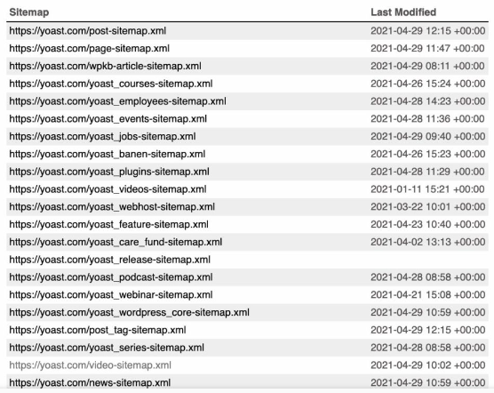

# Đồ án cuối kì (Môn thiết kế giao diện)
>Thành viên:
>- Nguyễn Khắc Minh Tân_2174802010439 (Nhóm trưởng)
>- Đỗ Thị Thanh Loan_2174802010580
>- 

### Đề tài: Thiết kế giao diện website tin tức (như báo thanh niên, báo tuổi trẻ,...)
*Link tham khảo (Việt Nam)*
1. [Báo thanh niên](https://thanhnien.vn/)
2. [Báo tuổi trẻ](https://tuoitre.vn/)
3. [Báo dân trí](https://dantri.com.vn/)
4. [VTC News](https://vtc.vn/)
5. [Vietnamnet](https://vietnamnet.vn/)
6. [Vnexpress](https://vnexpress.net/)
7. [Báo lao động](https://laodong.vn/)

*Link tham khảm (Nước ngoài)*
1. [Yahoo! News](https://news.yahoo.com/)
2. [The guardian](https://www.theguardian.com/international)
3. [HuffPost](https://www.huffpost.com/)
4. [CNN](https://edition.cnn.com/)
5. [The New York Times](https://www.nytimes.com/international/)
6. [Fox News](https://www.foxnews.com/)
7. [NBC News](https://www.nbcnews.com/)

## Mục tiêu dự án
- Đáp ứng tất cả chỉ tiêu trong phần lí thuyết elearning
  - Cấu trúc website
  - Thói quen người dùng dựa trên đặc tính của website
  - Hệ thống liên kết
  - Tương tác trên web
  - Màu sắc, hình thức thể hiện,… 
  - Kết hợp với sitemap (XML, HTML)
    **Sitemap HTML**
    -  
    **Sitemap XML**
    - 
  - User flow và wireframe.

- Sử dụng các phần mềm thiết kế giao diện 
  - Figma
  - Photoshop